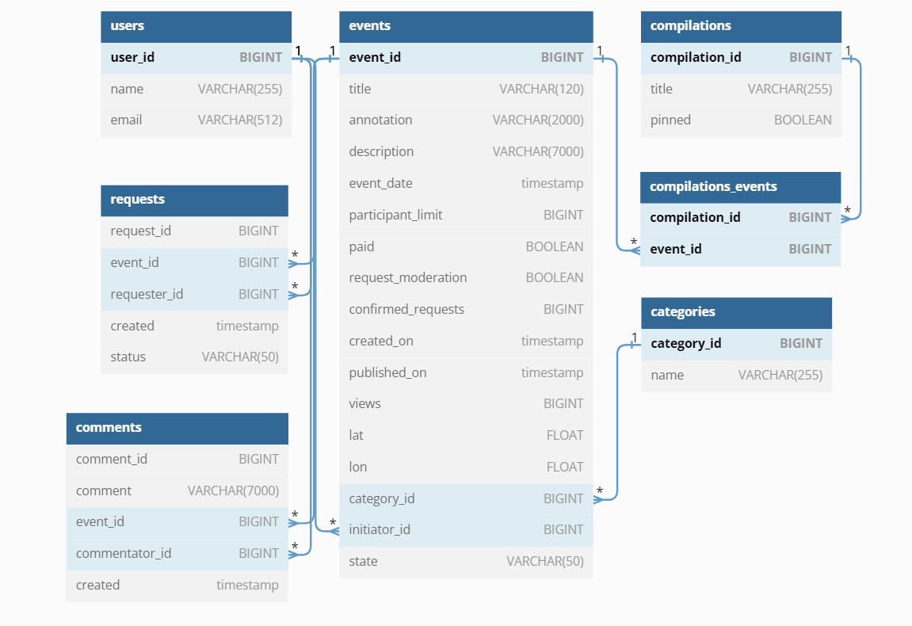

Ссылка на пуллреквест:
https://github.com/ihatelags/java-explore-with-me/pull/2

# Explore With Me
Дипломный проект - бэкэнд приложения ExploreWithMe (англ. «исследуй со мной»). Оно должно давать возможность делиться информацией об интересных событиях и помогать найти компанию для участия в них. 

## Идея
Свободное время — ценный ресурс. Ежедневно мы планируем, как его потратить — куда и с кем сходить. Сложнее всего в таком планировании поиск информации и переговоры. Какие намечаются мероприятия, свободны ли в этот момент друзья, как всех пригласить и где собраться. Приложение, которое вы будете создавать, — афиша, где можно предложить какое-либо событие от выставки до похода в кино и набрать компанию для участия в нём.

## Два сервиса
Основной сервис — содержит всё необходимое для работы продукта.
Сервис статистики — хранит количество просмотров и позволяет делать различные выборки для анализа работы приложения.

## Основной сервис
API основного сервиса разделен на три части. Первая — публичная, доступна без регистрации любому пользователю сети. Вторая — закрытая, доступна только авторизованным пользователям. Третья — административная, для администраторов сервиса.

### Публичный API
Публичный API предоставляет возможности поиска и фильтрации событий.
- Сортировка списка событий организована либо по количеству просмотров, которое должно запрашиваться в сервисе статистики, либо по датам событий.
- При просмотре списка событий возвращается только краткая информация о мероприятиях.
- Просмотр подробной информации о конкретном событии настроен отдельно (через отдельный эндпоинт).
- Каждое событие должно относится к какой-то из закреплённых в приложении категорий.
- Настроена возможность получения всех имеющихся категорий и подборок событий (такие подборки будут составлять администраторы ресурса).
- Каждый публичный запрос для получения списка событий или полной информации о мероприятии фиксируется сервисом статистики.

### API для авторизованных пользователей
Закрытая часть API призвана реализовать возможности зарегистрированных пользователей продукта.
- Авторизованные пользователи могут добавлять в приложение новые мероприятия, редактировать их и просматривать после добавления.
- Настроена подача заявок на участие в интересующих мероприятиях.
- Создатель мероприятия имеет возможность подтверждать заявки, которые отправили другие пользователи сервиса.

### API для администратора
Административная часть API должна предоставлять возможности настройки и поддержки работы сервиса.
- Добавление, изменение и удаление категорий для событий.
- Есть возможность добавлять, удалять и закреплять на главной странице подборки мероприятий.
- Настроена модерация событий, размещённых пользователями, — публикация или отклонение.
- Настроено управление пользователями — добавление, просмотр и удаление.

## Сервис статистики
Второй сервис, статистики, призван собирать информацию. Во-первых, о количестве обращений пользователей к спискам событий и, во-вторых, о количестве запросов к подробной информации о событии. На основе этой информации формируется статистика о работе приложения.

Функционал сервиса статистики содержит:
- запись информации о том, что был обработан запрос к эндпоинту API;
- предоставление статистики за выбранные даты по выбранному эндпоинту.

### Модель данных
Жизненный цикл события должен включает несколько этапов.
- Создание.
- Ожидание публикации. В статус ожидания публикации событие переходит сразу после создания.
- Публикация. В это состояние событие переводит администратор.
- Отмена публикации. В это состояние событие переходит в двух случаях. Первый — если администратор решил, что его нельзя публиковать. Второй — когда инициатор события решил отменить его на этапе ожидания публикации.

## Спецификация API
спецификация основного сервиса: ewm-main-service-spec.json
спецификация сервиса статистики: ewm-stats-service.json

## ER-модель EWM service:

